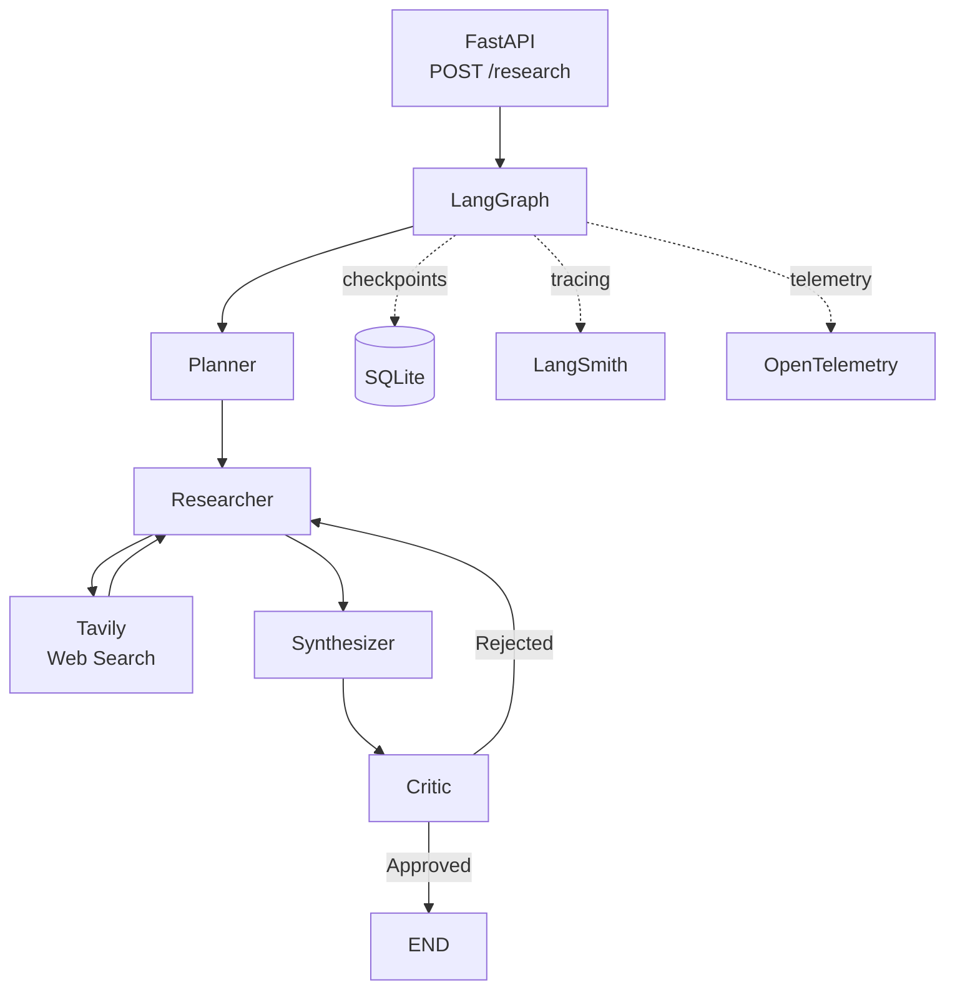
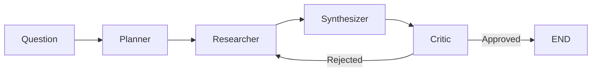

# Production-Oriented Research Agent

A production-oriented LLM research workflow built with **LangGraph**, **Pydantic**, **Instructor**, **Tavily**, and **FastAPI**.

The agent plans a research task, searches the web, synthesizes an answer, critiques the result, and retries the research when the answer is not approved. Workflow state is persisted with SQLite, while **LangSmith** and **OpenTelemetry** provide observability.

## Architecture



## Workflow



1. **Planner** — creates structured sub-questions and search queries.
2. **Researcher** — searches the web with Tavily, deduplicates URLs, and limits the number of sources.
3. **Synthesizer** — produces a source-grounded draft.
4. **Critic** — evaluates the draft and returns structured feedback.
5. **Retry** — rejected answers are sent back to the researcher, with a retry limit preventing infinite loops.

## Tech Stack

| Technology            | Purpose                            |
| --------------------- | ---------------------------------- |
| **Python**            | Application code                   |
| **LangGraph**         | Stateful workflow orchestration    |
| **Pydantic**          | Data models and validation         |
| **Pydantic Settings** | Centralized configuration          |
| **Instructor**        | Structured LLM outputs             |
| **OpenAI SDK**        | LLM client                         |
| **Tavily**            | Web research                       |
| **SQLite**            | LangGraph checkpoint persistence   |
| **FastAPI**           | HTTP API                           |
| **LangSmith**         | LLM/agent tracing                  |
| **OpenTelemetry**     | Application telemetry              |
| **pytest**            | Unit testing                       |
| **uv**                | Package and environment management |

## Key Engineering Decisions

* **LangGraph** manages state, nodes, conditional routing, and retry loops.
* **Pydantic + Instructor** provide structured outputs for the planner and critic.
* **SQLite checkpointing** allows workflow state to survive application restarts.
* **`thread_id`** identifies persisted workflow state.
* **Tavily is isolated** behind a search tool so the workflow is not tightly coupled to the provider.
* **External errors are translated** into application-level errors before reaching the API.
* **LangSmith and OpenTelemetry** provide complementary observability: LangSmith focuses on LLM/agent execution, while OpenTelemetry provides application-level tracing.
* Configuration is centralized with **Pydantic Settings** rather than reading environment variables throughout the application.

## Project Structure

```text
research-agent/
├── src/
│   └── research_agent/
│       ├── main.py
│       ├── graph.py
│       ├── llm.py
│       ├── config.py
│       ├── state.py
│       ├── schemas.py
│       ├── observability.py
│       ├── nodes/
│       │   ├── planner.py
│       │   ├── researcher.py
│       │   ├── synthesizer.py
│       │   └── critic.py
│       └── tools/
│           └── search.py
├── tests/
├── .env
├── pyproject.toml
└── README.md
```

## Running Locally

Install dependencies:

```bash
uv sync
```

Create a `.env` file in the project root:

```env
OPENAI_API_KEY=...
TAVILY_API_KEY=...

LANGSMITH_TRACING=true
LANGSMITH_API_KEY=...
LANGSMITH_PROJECT=research-agent
```

Run the API:

```bash
uv run uvicorn research_agent.main:app --reload
```

## API

### Start a research workflow

```http
POST /research
```

```json
{
  "question": "What are the main benefits and limitations of LangGraph?",
  "thread_id": "demo-001"
}
```

### Retrieve persisted state

```http
GET /research/{thread_id}
```

The endpoint reads the latest LangGraph checkpoint without rerunning the workflow.

### Health check

```http
GET /health
```

## Testing

Run the test suite with:

```bash
uv run pytest
```

Tests focus on application logic such as schema validation, source deduplication, missing-plan handling, and critic behavior. External services are mocked rather than called during unit tests.

## What This Project Demonstrates

This project is intentionally small, but covers several production-oriented AI engineering concepts:

**stateful LLM workflows · structured outputs · web research · evaluation and retry · persistence · API design · error handling · testing · observability**

## Future Improvements

* PostgreSQL checkpointing for a multi-instance deployment
* More robust research evaluation
* Additional API endpoints for workflow control
* Production telemetry backends

## License

MIT
